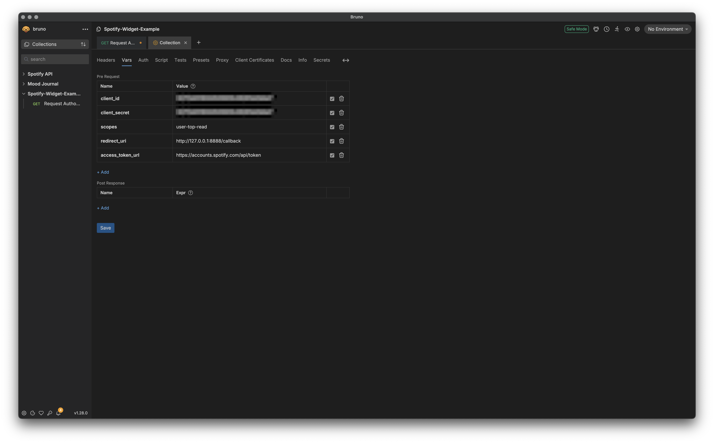
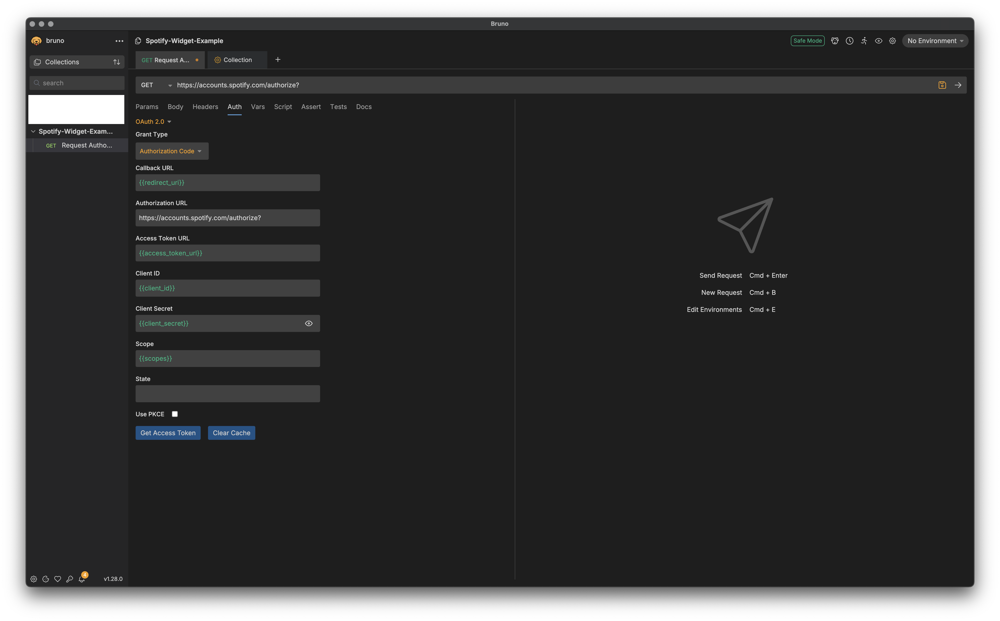

In the previous post, I walked you through setting up an Astro project that we would use to build a Spotify widget. This post will walk through the process of registering an application on Spotify's developer portal, getting an access token to use for making requests to the Spotify web API using the open-source Bruno API client, and how to make requests using that token.

This walkthrough assumes you have a Spotify account – after all, if you didn't, why would you be trying to make your Spotify data publicly visible? I also make use of an API client to get a refresh token from Spotify. In my case, I use the [Bruno API client](https://www.usebruno.com/), but you can use any client you want, or even just `curl` from the command line if you like. I like using an API client because it simplifies the process for requesting an access token and a refresh token, which makes our lives easier as developers!

## How Our Application Will Work

In this case, the refresh token that we will get back from the Spotify authentication and authorization handshake is long-lived. To my knowledge, it won't automatically expire due to a time limit. To me, it felt like environment variables would be a good fit for storing a token that we don't expect to expire. Netlify provides a convenient API for storing and consuming [environment variables](https://docs.netlify.com/build/configure-builds/environment-variables/), which is another argument in favor of using an environment variable to store our refresh token.

Access tokens, on the other hand, are _not_ long-lived. The ones we get from Spotify expire every hour. In a more robust (read: professional) application, you would store this access token in some way and check if it was expired before issuing requests to the protected resources trying to access. If the token is not expired, you can fire the request immediately to the API, but if the token is expired, you use the refresh token to get another access token, and then use the new access token as you would expect. In one case, you save yourself an additional request to the refresh token endpoint.

We must consider the limitations of serverless functions. Netlify’s serverless functions don’t keep state reliably, so while we could theoretically cache access tokens briefly to save ourselves some requests to the refresh token endpoint, cold starts mean we should expect to request new access tokens frequently anyway.

With those considerations in mind, it is most straightforward to use the refresh token endpoint to obtain a new access token every time we want to access the Spotify API. While this means that we are _always_ making at least two requests when we are trying to get data from a Spotify API endpoint, I can live with that because it doesn't cause any significant problems. While it adds some latency and makes the UX a little sluggish, that's a tradeoff I'm comfortable with given the nature of how I'm using this application. My personal site gets little traffic, and I have also implemented a caching strategy that should help reduce the number of times I'm actually issuing requests to Spotify.

## Registering An App on Spotify

Navigate to [https://developer.spotify.com/](https://developer.spotify.com/) and log in.

Once you've logged in, take a look at the documentation. The [documentation for the Web API](https://developer.spotify.com/documentation/web-api) has instructions for how to register an application that will consume the Web API. I found the docs take a little time to get familiar with, so I'll try to point you to the resources you need to use at each step of the process, but the link above should be your main entry point into the documentation.

Before you can consume the Web API you need to register an application on your [developer dashboard](https://developer.spotify.com/dashboard). A few tips about this part of the process:

- You can name the app anything you like. I named mine `spotify-widget-example` for the purposes of this tutorial.
- You don't have to provide the address of a live site for the Website URL. In my case, I used the made-up `https://my-spotify-widget.dev` for the main Website URL.
- For the Redirect URI field, there are some pitfalls to be aware of. Because of how I built this app we are only going through the authorization process once, and we are going to do it only in our development environment and then store the long-lived refresh token we get back from this process to use later. We need to choose a redirect URI that is tailored to our development environment. Spotify's [documentation on Redirect URIs](https://developer.spotify.com/documentation/web-api/concepts/redirect_uri) is instructive here but the important points for our purposes:

  - The use of `localhost` in the redirect URI field is not allowed. Instead we must use `http://127.0.0.1:<port>`. The default address that Netlify CLI spins up a server at is `http://localhost:8888`, so we should make our address: `http://127.0.0.1:8888/callback`.

- You can ignore the "Bundle IDs" and "Android Packages" fields/leave them blank.
- For the purposes of this tutorial, in the "APIs Used" section select only the "Web API" option.

After you've registered an application with the Spotify developer portal, you will want to make note of your application's Client ID, as well as your Client Secret. If you don't feel like writing them down, they will remain available in the Spotify developer portal for later viewing.

## Choosing an Auth Flow

Spotify's Web API offers several authorization flows depending on the type of application you're building. Because our application is going to be a long-running web application in which we can safely store our client secret (by setting environment variables that the browser can't see), Spotify recommends that we use their [Authorization Code Flow](https://developer.spotify.com/documentation/web-api/tutorials/code-flow).

The auth flow we are using has two parts:

1. In the first part of the handshake, the user (ourselves, in this case) must authorize the application by providing our Spotify account credentials and confirming the access level(s) we are granting the application. After a successful authorization of the application, Spotify will return to us an authorization code.

2. After we receive the authorization code, we must then send a `POST` request to a specific endpoint including the authorization code we got from the authorization step. If this POST request is successful, we will receive an access token and a refresh token in return. Once we have these tokens, we can use them to request data from protected endpoints on the Spotify API.

## Creating a Collection in Bruno

Bruno does have a [guide on the Authorization Code Grant Type](https://docs.usebruno.com/auth/oauth2/authorization-code) OAuth2.0 flow that is a useful reference, but I will endeavor to walk you through the main parts here.

1. Open Bruno.
2. Create a new collection by clicking the meatball menu at the top left of the application near the Bruno logo. You can name your collection whatever you like, but I named mine `Spotify Widget Example`.
3. In the collections panel on the left side of the Bruno application, hover your collection. There will be another meatball menu visible. Click the menu and click "Settings". This will open a "Settings" tab in the main content area of the Bruno application.
4. In the "Settings" tab, navigate to the "Vars" sub-menu. We are going to create a number of variables that we can use in our requests:

   1. Make a variable called `client_id` and set it equal to the value found in your application settings in the Spotify Web API.
   2. Make a variable called `client_secret` and set it equal to your application's client secret.
   3. Create a `scopes` variable and set it to `user-top-read`.
   4. Create a `redirect_uri` variable and set it to whatever you set your Redirect URI to when you registered your application with Spotify – it should be something like `http://127.0.0.1:8888/callback`.
   5. Create an `access_token_url` variable and set it equal to `https://accounts.spotify.com/api/token`
   6. Proofread your variable names and values, and when everything looks good, click the save button.

Your collection's Vars panel should look like this when you are done:


An important thing to note is the value of the `scopes` variable. The `scopes` variable [determines what resources we can access](https://developer.spotify.com/documentation/web-api/concepts/scopes) from the Spotify API, and is encoded into the authorization tokens we get from the Spotify auth server. If you try to access resources that do not fall under the scope we set in our `scopes` variable, we must add the appropriate scope to this variable. The `user-top-read` scope will allow us to request data about a user's top artists.

> AI told me that the name of the UI element commonly represented by 3 dots (...) can be referred to as a meatball menu. Whether that's true or not, I really like that name for it so that's what I'm going to call it from now on.

## Create an Authorization Request in Bruno

Once we have some variables defined, we can create a request to authorize our application.

1. In the collections panel on the left side of the Bruno app, hover your `Spotify Widget Example` collection and click the meatball menu, then click "New Request". Name the request whatever you like, but I named mine `Request Authorization`. Set the URL field to `https://accounts.spotify.com/authorize?`, and make sure the request type is a `GET` request.
2. If Bruno does not open a tab for your new request in the main content area of the Bruno app, click the request to do so. Navigate to the "Auth" submenu of the request in the main content area of the Bruno app.
3. Under the Auth submenu, make sure that `OAuth2.0` is selected. Set the "Grant Type" to "Authorization Code".
4. We are going to use the variables we set earlier to populate the fields Bruno wants us to provide. To access one of our variables, we use two curly brackets with the name of the variable like so: `{{your_variable_name}}`

   - For the "Callback URL" field, set the value to `{{redirect_uri}}`
   - For the "Authorization URL" field set the value to `https://accounts.spotify.com/authorize?`
   - For the "Access Token URL" set the value to `{{access_token_url}}`
   - For the "Client ID" field set the value to `{{client_id}}`
   - For the "Client Secret" field the input will be obscured but you can still use your variable by setting the field to `{{client_secret}}`. The UI allows you to click a little eye icon to verify what you've entered in this field.
   - For the "Scope" field, set the value to `{{scopes}}`

Your request's Auth panel should look similar to this when you're done:


## Authorizing our Application

If we have done everything correctly to this point, we should have a collection that contains one `GET` request in it. That `GET` request should be configured (via the request's "Auth" tab) to complete the OAuth2.0 flow for the Authorization Code grant type. At this point there's one thing left to do: Send our request!

In your request's Auth tab, you should see a button that says "Get Access Token". Click it!

If everything is formatted correctly, Bruno's integrated browser will navigate to a Spotify authorization portal. You will then be prompted to provide the email address associated with your Spotify account, and then a login code will be sent to the email address you provide. Once you've entered your email address, the login code, and successfully authorized the application, Bruno will automatically do the rest of the authorization flow for us. Upon a successful request for authorization, we should get a response back that looks like this:

```json ""access_token": "<access_token>"" ""refresh_token": "<bearer_token>""
{
  "access_token": "<access_token>",
  "token_type": "Bearer",
  "expires_in": 3600,
  "refresh_token": "<bearer_token>",
  "scope": "user-top-read"
}
```

In the next steps, we will talk about how our application will work, and what we will do with the tokens we get back from a successful authorization of our application.

## Storing Our Refresh Token For Development

Of the two tokens we get back from successfully completing the authorization flow, the one we want to store is the `refresh token`. In the root of your project. create a file `.env`. At this point your project should look like:

```bash "├── .env"
.
├── .env
├── .gitignore
├── astro.config.mjs
├── netlify
│   └── functions
│       └── getTopArtists.mjs
├── netlify.toml
├── package.json
├── public
│   └── favicon.svg
├── README.md
├── src
│   ├── components
│   │   └── GetTopArtists.jsx
│   └── pages
│       └── index.astro
├── tsconfig.json
└── yarn.lock
```

After creating your `.env` file, make sure to update your `.gitignore` to avoid accidentally committing any secrets to source control. My `.gitignore` file looks like this:

```bash "# environment variables" ".env*"
# build output
dist/
# generated types
.astro/

# dependencies
node_modules/

# logs
npm-debug.log*
yarn-debug.log*
yarn-error.log*
pnpm-debug.log*


# environment variables
.env*

# macOS-specific files
.DS_Store

# jetbrains setting folder
.idea/

# Ignore netlify CLI output
.netlify/

```

In your `.env` file, store your app's client secret, client ID, and the refresh token you got back from successfully authenticating my app.

Your `.env` file should look similar to this when you are done:

```bash
CLIENT_SECRET="<client_secret>"
CLIENT_ID="<client_id>"
REFRESH_TOKEN="<refresh_token>"
```

We will later use these variables to make requests to the Spotify API. We can also be sure that these variables will not be leaked to the browser by virtue of the fact that they will be stored on Netlify and our application (in this case a serverless function) will consume them at build time.

## Wrapping Up

In this part of the tutorial, we registered and configured our application on the Spotify API developer portal. Then, we created and configured a collection in Bruno, and subsequently created a request we can use to authorize our Spotify application and automatically procure a refresh token and access token.

We created a `.env` file in which we stored some important variables that will be used in our requests to the Spotify API.

In the next part of the guide, I will show how I built a serverless function to fetch data from the Spotify API using our refresh token and some of the application secrets we were given when we registered our application on the Spotify developer portal.

## Additional Resources

1. This [post by Thomas Moran](https://thomasmoran.dev/snippets/spotify-currently-playing/spotify-currently-playing/) details how to go through the authorization and authentication process without the use of automations provided by an API client.

2. This [Medium article by Alagappan M](https://medium.com/@alagappan.dev/create-a-now-playing-widget-using-the-spotify-web-api-in-react-a6cb564ed923) details how to manually step through the Authentication and Authorization process, and details building a similar widget to display a "Now Playing" widget.
